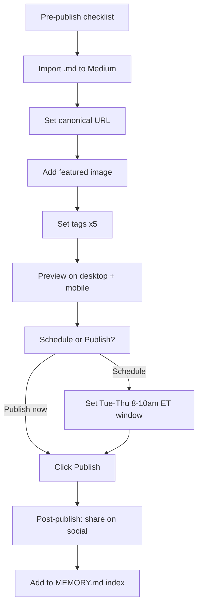

# Medium Publication Checklist — Article 1

> Article: "14.5 Microseconds: Real-time RCE Detection for AI Workloads"
> Source: `article-1.html` | Medium draft: `medium-article-1.md`
> Target date: July 22, 2026

---

## Pre-Publish: Medium Formatting Quirks

- [ ] **No HTML tags.** Medium's importer strips or misrenders HTML. The markdown file is already clean — verify no stray `<div>`, `<span>`, or `<style>` tags survived the conversion.
- [ ] **Tables render as images.** Medium does not support native markdown tables. For the latency comparison table, either:
  - Paste as a screenshot (recommended — see Image Suggestions below)
  - Or format each row as a bullet list as fallback
- [ ] **Code blocks.** Use triple backticks with language tags. Medium renders these well. Verify the ASCII-art agent pipeline renders correctly in Medium's preview (it may need to be a screenshot instead).
- [ ] **Bold/italic.** Medium supports `**bold**` and `*italic*`. Key numbers (`14.5 µs`, `80,000`, `24 rules`, `5×`) should be bolded — verify they survived paste.
- [ ] **Horizontal rules.** `---` works in Medium as a visual separator. Confirm Medium does not eat them.
- [ ] **Superscript/subscript.** Medium has no native superscript for "µs" — use the literal Unicode character `µ` (U+00B5) instead of `&micro;`.
- [ ] **Em dashes.** Use `—` (Unicode em dash, U+2014) not `--` or `&mdash;`. Medium converts `--` but inconsistently in paste.
- [ ] **Paste via Import, not copy-paste.** Use Medium's "Import a story" feature (top-right menu > Story > Import) with the `.md` file for best formatting preservation. If importing fails, paste as plain text and re-apply formatting manually.
- [ ] **Import check.** After import, scroll through the entire article. Medium's import tool sometimes drops the first/last paragraph or mangles list indentation.
- [ ] **Title vs H1.** Medium treats the title field separately from body text. Paste the H1 title into Medium's title box, not the body. The body should start with the subtitle or the first paragraph.

## SEO Checklist

- [ ] **Title tag:** "14.5 Microseconds: Real-time RCE Detection for AI Workloads" (exact match with source)
- [ ] **Meta description** (Medium generates from first paragraph — ensure the hook paragraph is compelling)
- [ ] **Tags (3 max for Medium):**
  - `Security` (primary)
  - `AI` (secondary)
  - `DevOps` or `Cybersecurity` (whichever fits better — pick `Cybersecurity`)
- [ ] Actually Medium allows up to 5 tags. Use these 5:
  - `Security`
  - `Artificial Intelligence`
  - `Cybersecurity`
  - `DevOps`
  - `Programming`
- [ ] **Canonical URL:** Set to `https://correctover.com/en/blog/article-1.html`
  - **How to set:** In Medium editor, click the three-dot menu (top right) > "More settings" > scroll to "Advanced" > "Set canonical link" > paste `https://correctover.com/en/blog/article-1.html`
  - This prevents Medium from outranking the original post in Google SERP.
- [ ] **Custom slug** (optional): Edit the URL slug before publishing — change from auto-generated to `14-5-microseconds-rce-detection-ai-workloads`
- [ ] **Image alt text:** All images must have descriptive alt text (Medium calls it "Alt text" in the image caption editor).
- [ ] **Internal links:** Ensure all links (GitHub, Correctover homepage, article-3) use `https://` full URLs. Medium does not support relative links.

## Image Suggestions

### 1. Benchmark Results Stat Card (Lead Image / Header)

- **What:** A dark background card with the four metric boxes (14.5µs P50, 32µs P90, 99µs P99, 187µs P99.9) in the Correctover teal accent color (`#4fc3b7`)
- **Why:** This is the article's strongest visual hook. It communicates the core result in under 2 seconds.
- **Format:** 1400×800px PNG, dark theme matching the brand
- **Alt text:** "Correctover benchmark results: P50 14.5 microseconds, P90 32 microseconds, P99 99 microseconds, P99.9 187 microseconds"
- **Caption:** "Correctover detection engine latency across 80K production traces. Lower is better."

### 2. Architecture Diagram (How It Works)

- **What:** A simplified flow diagram showing: User Request → LLM Call → Correctover Detection Engine (FSM + SIMD + Arena) → Model Provider → Response
- **Why:** Visualizes the zero-overhead inline detection architecture
- **Format:** 1400×800px PNG, dark theme
- **Alt text:** "Architecture diagram showing Correctover's detection engine intercepting LLM calls with 14.5 microsecond latency"
- **Caption:** "Correctover's detection engine sits inline with the LLM call path, not as a separate proxy hop."

### 3. Industry Comparison Chart (Benchmark Positioning)

- **What:** A horizontal bar chart comparing P50 latencies: TCP connect (~500µs), TLS handshake (~5000µs), WAF (~200µs), Envoy sidecar (~150µs), regex filter (~80µs), Correctover (14.5µs)
- **Why:** Makes the "5x faster than regex" claim visually undeniable
- **Format:** 1400×800px PNG
- **Alt text:** "Bar chart comparing Correctover's 14.5 microsecond latency against industry alternatives: TCP, TLS, WAF, sidecar proxy, and regex filters"
- **Caption:** "Correctover is 5× faster than a regex filter while running 24 structured detection rules."

### 4. Agent Pipeline Visualization (Why Latency Compounds)

- **What:** A flow showing User → Planner → Researcher → Coder → Reviewer → Final, with call-out boxes showing "13 detection points × 14.5µs = 189µs" vs "13 × 5ms = 65ms"
- **Why:** Makes the compounding argument concrete and visual
- **Format:** 1400×600px PNG
- **Alt text:** "Agent call chain visualization showing 13 detection points per user request and the cumulative latency at 14.5 microseconds versus 5 milliseconds"

## Medium Editor Checklist

- [ ] **Preview on mobile:** Medium's editor has a mobile preview toggle. Check that code blocks, tables (if screenshotted), and the CTA look correct on small screens.
- [ ] **Read time:** Medium auto-calculates read time. Target 5–7 min read. If it says <5 min, the article may be too short.
- [ ] **Subtitle field:** Medium has a dedicated subtitle line below the title. Paste the subtitle there: "How we benchmarked runtime security across 80,000 production traces"
- [ ] **Featured image:** Set the Benchmark Results Stat Card as the featured image (shows in Medium feed). Medium recommends 1400×800px minimum.
- [ ] **Claps and responses:** Under "More settings", enable responses if you want discussion. Disable if republishing from the main site (to drive comments to correctover.com instead).
- [ ] **Member-only toggle:** Decide: make it public (wider reach, better for SEO) or member-only (monetization). Recommendation: **public** — this is a BD/awareness article, not a monetization play.
- [ ] **Publication affiliation:** If Correctover has a Medium publication, publish under the publication name. If not, consider creating one.

## Best Posting Times

- **Primary window:** Tuesday–Thursday, 8:00–10:00 AM Eastern Time (US)
- **Secondary window:** Tuesday–Thursday, 12:00–1:00 PM ET (lunchtime read)
- **Avoid:** Weekends, Monday mornings, Friday afternoons, major US holidays
- **Time zone conversion for reference:**
  - ET 8:00 AM = PT 5:00 AM = UTC 12:00 PM = CST 8:00 PM (China)
  - ET 10:00 AM = PT 7:00 AM = UTC 2:00 PM = CST 10:00 PM (China)

## Publication Flow



## Post-Publish

- [ ] **Share on Twitter/X** with link to Medium article
- [ ] **Share on LinkedIn** with a short summary paragraph
- [ ] **Share in relevant communities:** r/netsec, r/machinelearning, Hacker News (if appropriate)
- [ ] **Update article-1.html** with a "Also published on Medium" badge/link
- [ ] **Add to MEMORY.md** index under `ref_*` — e.g. `ref_medium-article-1-published`
- [ ] **Monitor analytics** (Medium stats tab) for 7 days — track reads, read ratio, and referrers
- [ ] **Social sync** — generate social promotion copy and post (per BD automation rules)

---

## Quick Reference: Canonical URL Setup in Medium

```
Medium Editor → ⋮ (three-dot menu, top right)
  → "More settings" (scroll down)
  → "Advanced" section
  → "Set canonical link" toggle → ON
  → Paste: https://correctover.com/en/blog/article-1.html
  → Save
```

Setting the canonical URL tells Google that the correctover.com version is the original and prevents SEO penalties for duplicate content.
